# Offiql User Manager
This Flutter application is developed as part of an intern assignment. It demonstrates responsive UI design, state management, REST API integration, and includes features like user detail pages, adding new users, and real-time search filtering.

---

## Features
- **Home Page**
   - Displays a list of users fetched from a REST API.
   - The layout adapts to different screen sizes (mobile, tablet, desktop) to ensure a responsive user experience.
   - Includes a search bar to filter users by name.
- **User Detail Page**
   - Navigate to a detail page by tapping on a user from the list.
   - The detail page shows additional information about the selected user (name, email, phone, etc.).
- **Add New User**
   - A form that allows you to add a new user locally.
   - Includes fields for name, email, and phone.
   - New users are stored locally and displayed in the list.
- **Error Handling (Bonus)**
   - Handles network errors when fetching data from the API.
   - Displays user-friendly messages when no internet connection is available.
--- 

# Technologies Used
**Flutter:** Framework for building the UI and managing state.<br>
**Provider:** For state management, to handle user data and interactions.<br>
**Connectivity Plus:** For handling network connection checks and errors.<br>
**REST API:** Fetches user data from jsonplaceholder API.<br>

---

# Screenshots

---

### Dark Mode Screens

#### About Me
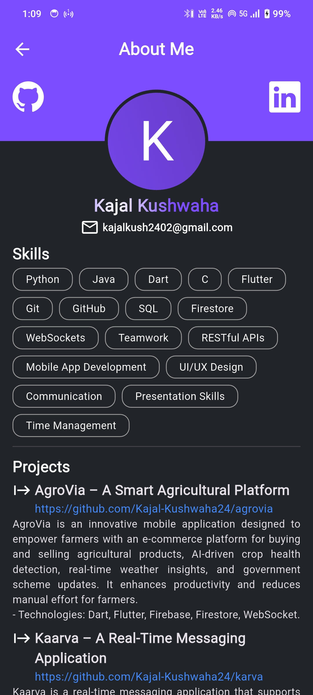

#### Add User
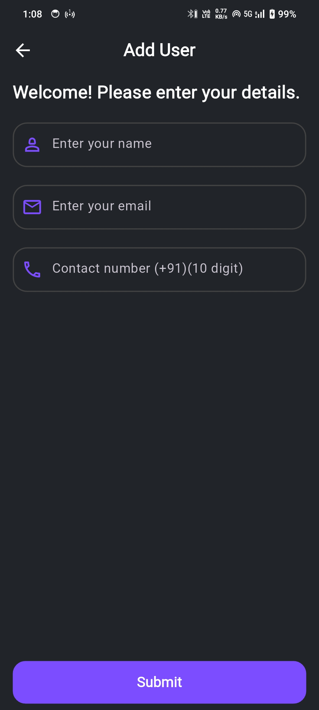

#### Home
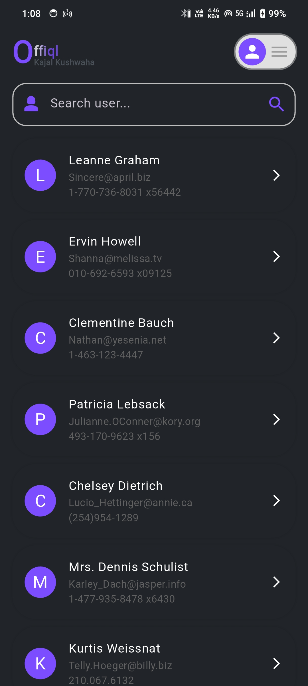

#### Internet and Loading
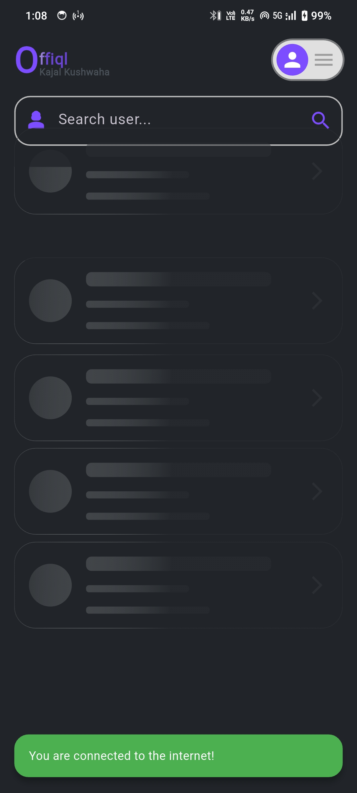

#### Loading Screen
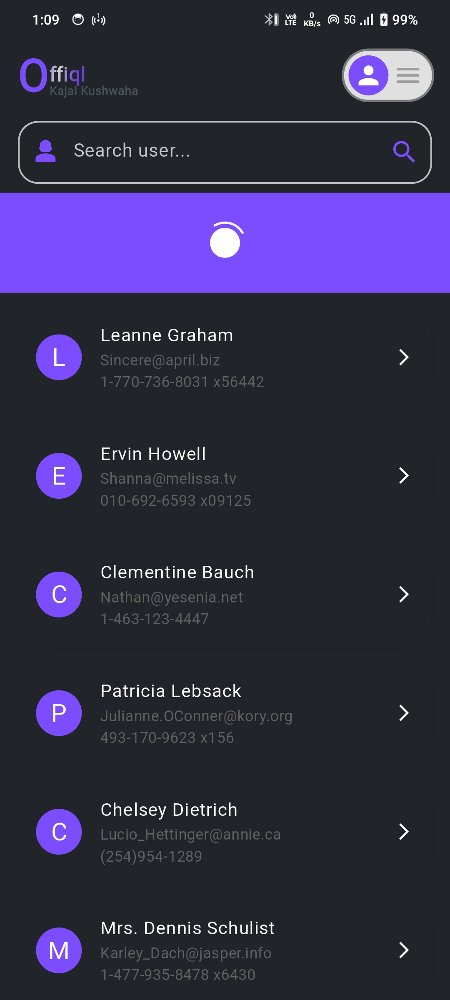

#### Local User
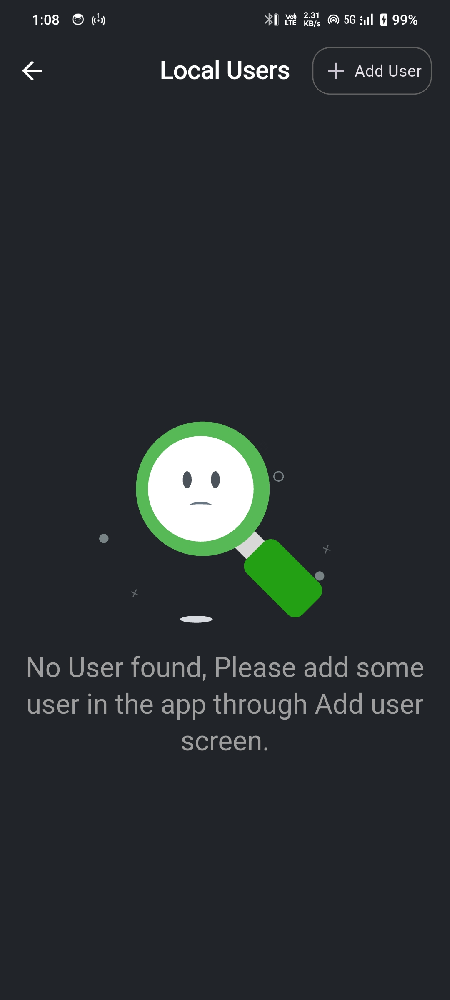

#### Local User Available
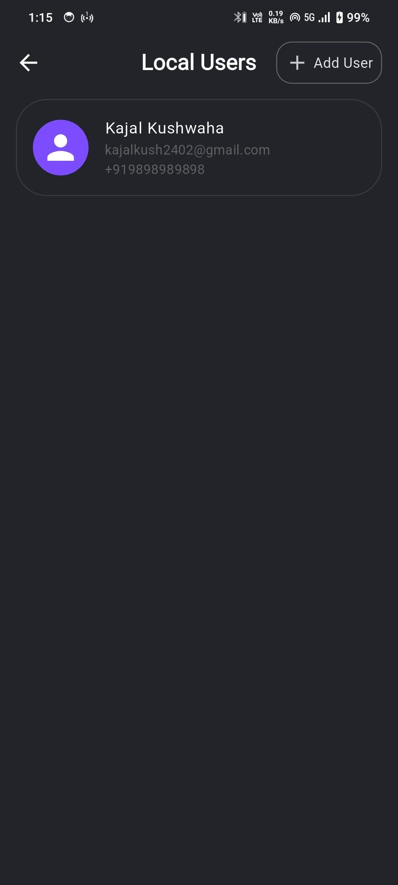

#### No Internet
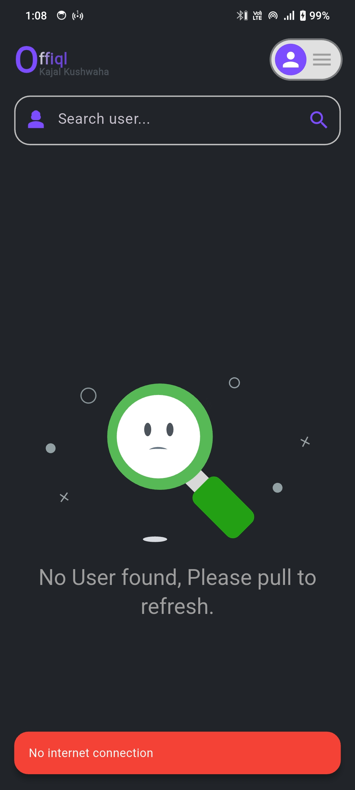

#### Refresh
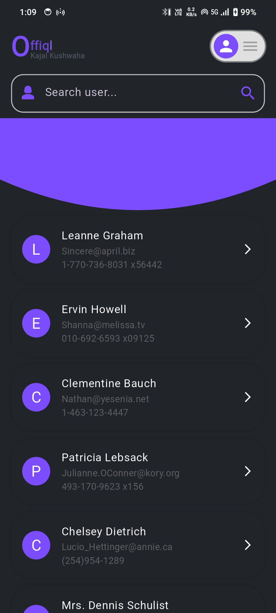

#### User Screen
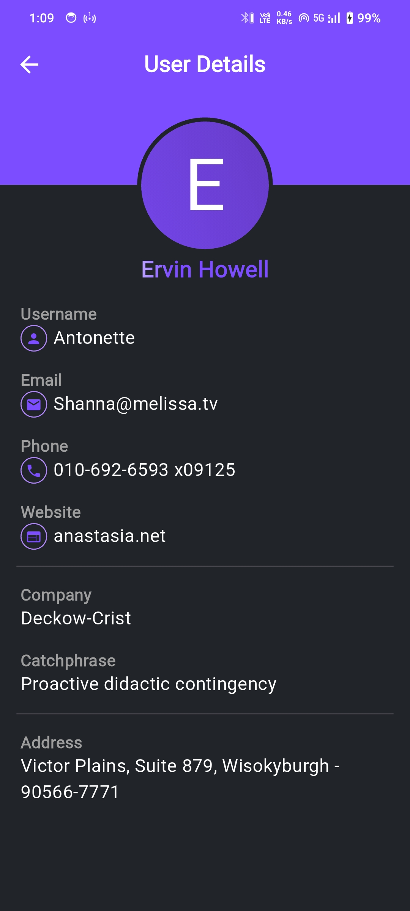


--- 

### Light Mode Screens

#### About Me
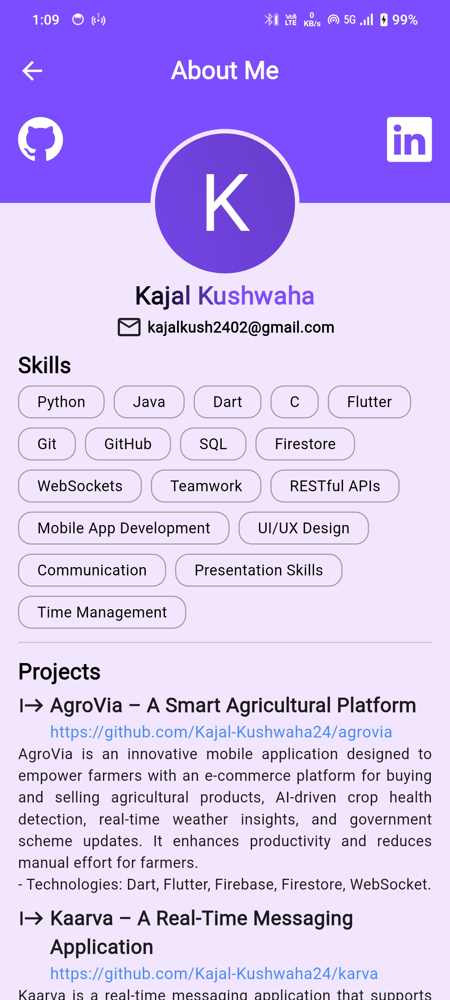

#### Add User
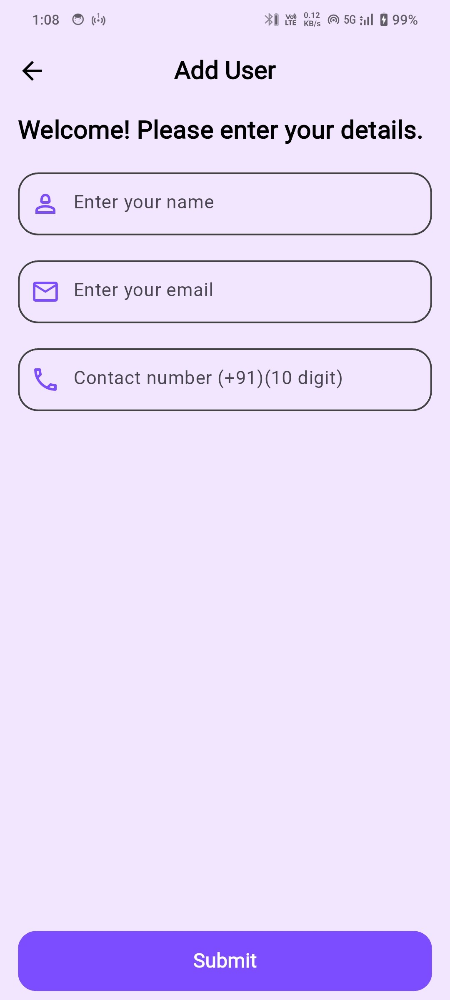

#### Home
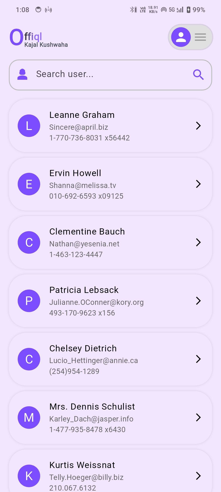

#### Local User
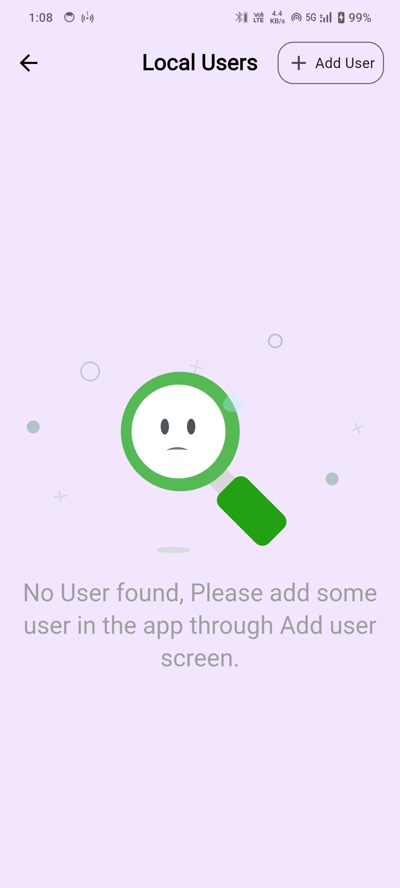

#### User Screen
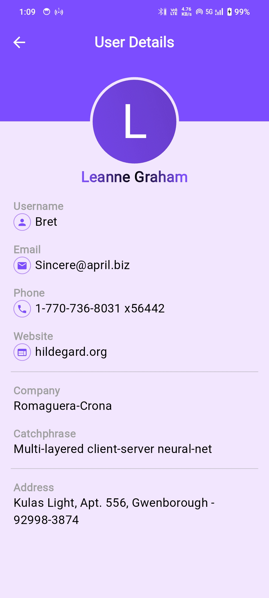


---

## Getting Started
**Prerequisites**
- Flutter SDK installed. Follow the official Flutter installation guide for your operating system.
- A code editor like VS Code or Android Studio.

## Setup Instructions
- Clone the repository:

``` bash
    git clone https://github.com/kajal-kushwaha24/offiql-user-manager.git
    cd flutter-intern-assignment
```

- Install dependencies: Run the following command in the project directory to install all the necessary packages:

```bash
  flutter pub get
```
- Run the app: To start the app on your emulator or connected device, use the command:

```bash    
    flutter run
```

- API Endpoint Used

### This app fetches the user list from the following API endpoint:
GET https://jsonplaceholder.typicode.com/users

## How to Use
- **Home Screen:**
   - Displays a list of users.
   - You can search for users by typing in the search bar.
   - Tap on any user to view detailed information.


- **Add a New User:**
   - Use the "All user option" to see the all local user and user top right button to fill out a form with name, email, and phone.
   - The new user will be added locally and appear in the all local user list.

- **Internet Connection:**
   - The app checks for internet connection and shows messages when the connection is lost or restored.


---

# 📂 Project Structure
```bash

  lib/
  ├── Helper/
  │   └── showSnackbar.dart        # For showing SnackBars
  ├── Provider/
  │   ├── home.dart                # Home screen state management
  │   ├── theme.dart               # Theme provider for light/dark mode
  │   └── user.dart                # User provider for managing user data
  ├── Screens/
  │   ├── home_screen.dart         # Home screen UI and logic
  │   └── user_detail_screen.dart  # User detail page
  └── main.dart                    # Main entry point of the app
```

---

## Future Improvements
Searching by name: Implement a search feature that allows users to search for users by name.

---

## 🤝 Contribution Guidelines
#### We welcome contributions to enhance Offiql! Here’s how you can contribute:

- Fork this repository.
- Create a new branch for your feature (git checkout -b feature-name).
- Make your changes and commit them (git commit -m "Add feature-name").
- Push to the branch (git push origin feature-name).
- Submit a pull request.

---

## 📝 License
This project is released under the [MIT License](LICENSE).

## 🌐 Contact
### For questions, feedback, or collaborations, feel free to reach out:
- **Email**: `kajalkush2402@gmail.com`
- **GitHub**: [kajal-kushwaha24](https://github.com/kajal-kushwaha24)


# Thank you for using Offiql!